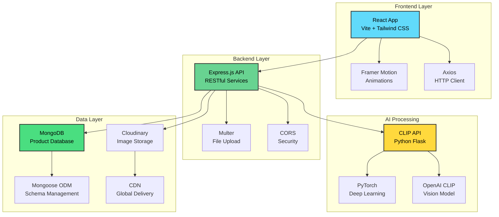

# L👀kalike - AI-Powered Visual Product Search

<div align="center">

[](https://nodejs.org/)
[](https://reactjs.org/)
[](https://python.org/)
[](https://mongodb.com/)
[](https://docker.com/)

*Find visually similar products using cutting-edge AI and computer vision*

[✨ Features](#-features) • [🚀 Quick Start](#-quick-start) • [📖 API Documentation](#-api-documentation) • [🏗️ Architecture](#️-architecture)

</div>

---

## 🌟 Overview

Lookalike is an AI-powered visual search platform that helps users find similar products by analyzing images using OpenAI's CLIP (Contrastive Language-Image Pre-training) model. Simply upload an image or provide a URL, and our intelligent system will find visually similar products from our extensive database.

### 🎯 Key Highlights
- **AI-Powered Search**: Leverages OpenAI CLIP for advanced image understanding
- **Real-time Results**: Lightning-fast similarity matching with cosine similarity
- **Smart Filtering**: Advanced filtering by gender, color, category, and similarity threshold
- **Modern UI**: Beautiful, responsive interface built with React and Tailwind CSS
- **Scalable Architecture**: Microservices architecture with Docker support
- **Cloud Integration**: Cloudinary integration for seamless image management

---

## ✨ Features

### 🔍 **Visual Search Engine**
- Upload images via drag-and-drop interface
- URL-based image input support
- Advanced similarity scoring with adjustable thresholds
- Real-time image processing and embedding generation

### 🎛️ **Smart Filtering System**
- **Gender**: Men, Women, Unisex
- **Colors**: Black, White, Blue, Red, Green, and more
- **Categories**: Apparel, Accessories, Footwear, Sporting Goods
- **Similarity Threshold**: Adjustable precision control (0-100%)

### 🎨 **Modern User Experience**
- Responsive design for all devices
- Smooth animations with Framer Motion
- Intuitive drag-and-drop file upload
- Glass-morphism UI design
- Dark mode optimized interface

### ⚡ **Performance & Scalability**
- Efficient vector similarity search
- Optimized database queries with MongoDB
- Containerized deployment with Docker
- Microservices architecture
- Cloud-ready infrastructure

---

## 🏗️ Architecture



---

## 🚀 Quick Start

### Prerequisites
- **Node.js** (v20+)
- **Python** (v3.11+)
- **MongoDB** (v4.4+)
- **Docker** (optional)

### 🐳 Docker Setup (Recommended)

```bash
# Clone the repository
git clone https://github.com/naman-kalwani/Lookalike.git
cd Lookalike

# Start all services with Docker Compose
docker-compose up -d

# The application will be available at:
# Frontend: http://localhost:8050
# Backend: http://localhost:5000
# CLIP API: http://localhost:8000
```

### 🛠️ Manual Setup

#### 1. Backend Setup
```bash
cd backend

# Install dependencies
npm install

# Set up environment variables
cp .env.example .env
# Edit .env with your configuration

# Start the server
npm start
```

#### 2. CLIP API Setup
```bash
cd backend/utils

# Create virtual environment
python -m venv venv
source venv/bin/activate  # On Windows: venv\Scripts\activate

# Install dependencies
pip install -r requirements.txt

# Start CLIP API server
python clip_api.py
```

#### 3. Frontend Setup
```bash
cd frontend

# Install dependencies
npm install

# Set up environment variables
cp .env.example .env
# Edit .env with your backend URL

# Start development server
npm run dev
```

### 📋 Environment Variables

#### Backend (.env)
```env
PORT=5000
MONGODB_URI=mongodb://localhost:27017/lookalike
FRONTEND_URL=http://localhost:5173
CLOUDINARY_CLOUD_NAME=your_cloud_name
CLOUDINARY_API_KEY=your_api_key
CLOUDINARY_API_SECRET=your_api_secret
CLIP_API_URL=http://localhost:8000
```

#### Frontend (.env)
```env
VITE_BACKEND_URL=http://localhost:5000
```

---

## 📖 API Documentation

### 🔍 Search Similar Products

**POST** `/api/products/search`

Search for visually similar products using image input and optional filters.

#### Request
```bash
curl -X POST http://localhost:5000/api/products/search \
  -F "file=@image.jpg" \
  -F "filters={\"gender\":\"Men\",\"similarity\":80}"
```

#### Parameters
| Parameter | Type | Description |
|-----------|------|-------------|
| `file` | File | Image file (JPG, PNG, GIF) |
| `imageUrl` | String | Alternative to file upload |
| `filters` | JSON | Search filters object |

#### Filters Object
```json
{
  "gender": "Men|Women|Unisex",
  "baseColour": "Black|White|Blue|Red|Green|...",
  "category": "Apparel|Accessories|Footwear|Sporting Goods",
  "similarity": 0-100
}
```

#### Response
```json
{
  "results": [
    {
      "productId": "12345",
      "name": "Stylish Cotton T-Shirt",
      "gender": "Men",
      "masterCategory": "Apparel",
      "subCategory": "Topwear",
      "articleType": "Tshirts",
      "baseColour": "Blue",
      "season": "Summer",
      "year": "2023",
      "usage": "Casual",
      "imageUrl": "https://example.com/image.jpg",
      "similarity": 0.95
    }
  ]
}
```

---

## 🛠️ Development

### 📁 Project Structure
```
Lookalike/
├── 📂 backend/                 # Express.js API server
│   ├── 📂 config/             # Database configuration
│   ├── 📂 controllers/        # Route controllers
│   ├── 📂 models/            # MongoDB schemas
│   ├── 📂 routes/            # API routes
│   ├── 📂 utils/             # Utilities & CLIP API
│   │   ├── clip_api.py       # Python CLIP service
│   │   ├── embeddings.js     # Embedding utilities
│   │   └── requirements.txt  # Python dependencies
│   ├── Dockerfile            # Backend container
│   └── package.json          # Node.js dependencies
├── 📂 frontend/               # React application
│   ├── 📂 src/
│   │   ├── 📂 components/    # React components
│   │   │   ├── FilterPanel.jsx
│   │   │   └── ResultCard.jsx
│   │   ├── App.jsx           # Main application
│   │   └── main.jsx          # Entry point
│   ├── Dockerfile            # Frontend container
│   └── package.json          # Frontend dependencies
├── 📂 data/                   # Data processing & analysis
│   ├── check.ipynb          # Data validation notebook
│   ├── uploadCloudinary.js  # Image upload utility
│   └── 📂 raw/              # Raw data files
│       ├── products.csv
│       └── styles.csv
└── README.md                 # Project documentation
```

### 🧪 Running Tests
```bash
# Backend tests
cd backend
npm test

# Frontend tests
cd frontend
npm test

# Python tests
cd backend/utils
python -m pytest tests/
```

### 🔧 Building for Production
```bash
# Build frontend
cd frontend
npm run build

# Build Docker images
docker build -t lookalike-frontend ./frontend
docker build -t lookalike-backend ./backend
docker build -t lookalike-clip ./backend/utils
```

---

## 🤝 Contributing

We love contributions! Here's how you can help:

1. **🍴 Fork the repository**
2. **🌿 Create a feature branch** (`git checkout -b feature/amazing-feature`)
3. **💾 Commit your changes** (`git commit -m 'Add amazing feature'`)
4. **📤 Push to the branch** (`git push origin feature/amazing-feature`)
5. **🎯 Open a Pull Request**

### 📋 Contributing Guidelines
- Follow the existing code style
- Add tests for new features
- Update documentation as needed
- Use meaningful commit messages

---

## 📄 License

This project is licensed under the **ISC License** - see the [LICENSE](LICENSE) file for details.

---

## 🙏 Acknowledgments

- **OpenAI CLIP** - For the amazing vision-language model
- **MongoDB Atlas** - For robust database solutions
- **Cloudinary** - For seamless image management
- **React Team** - For the incredible frontend framework
- **Express.js** - For the lightweight backend framework

---
